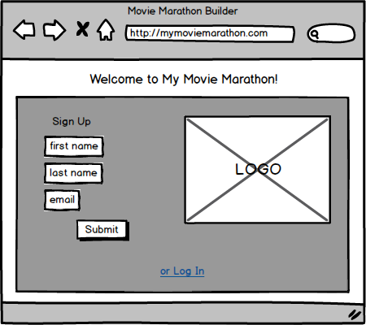
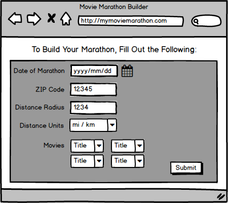
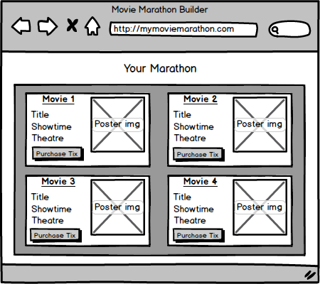
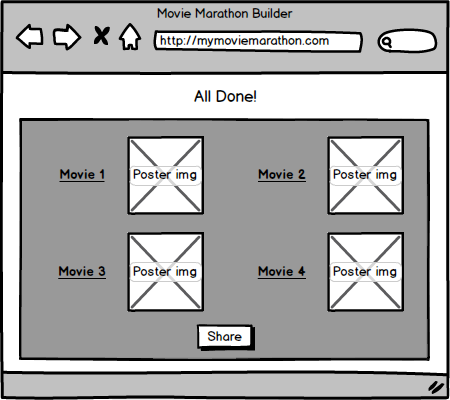
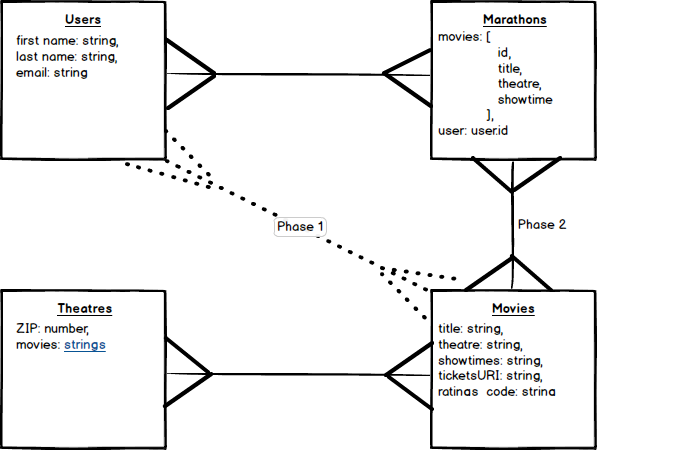

# Marathonr

*The Marathonr app builds movie marathons. Users enter their location data, pick a date, and select the movies they want to see, and Marathonr does the rest!*

### Lead Developer
[James Summers](https://github.com/jamesnsummers)

## Source Code
[Github](https://github.com/jamesnsummers/Marathonr-App)

### Project Planning on Trello
[Trello](https://trello.com/b/yG0nTo0W/project-03-movie-marathon-builder)

### Technologies Used

*Python, Django, SQLite, HTML, CSS, Bootstrap, Git, Github*

## Installation Steps
To make and run a Python/Django app, follow these instructions. You may already have certain aspects of this process set up on your machine. If so, skip ahead to the step that applies.<br>

*Install a Python Environment on your system. Type the following into the terminal:
<br><br>`brew install pyenv`
<br><br>Open ~/.bashrc and add the following between Rbenv and Git configs:
```bash
# Pyenv
export PYENV_ROOT=/usr/local/var/pyenv
eval "$(pyenv init -)"```
 `pyenv install 3.5.1`<br><br>
 `pyenv global 3.5.1`<br><br>
Python doesn't ship with the most up to date version of package manager pip, so upgrade pip:<br> <br>
`pip install --upgrade pip`<br><br>
`brew install pyenv-virtualenv`<br><br>
Add the following to `~/.bashrc` under your additions from step 2:
```bash
eval "$(pyenv virtualenv-init -)"
```
Install pylint for easy, on-the-fly debugging: <br>
`pip install pylint`<br>
You will need to install the package on your text editor as well. If you use Atom, like me:<br>
`apm install linter-pylint`<br><br>
Create the Django Project:<br>
`django-admin startproject Marathonr`<br><br>
Check to see if your app is ready by viewing a bare-bones template:<br>
`python manage.py runserver`<br><br>
Now create the Django <b>app</b>:<br>
`python manage.py startapp main_app`<br><br>
Now you're ready to start coding!*


## Existing Features / User Stories

*-User lands on homepage<br>
-User creates account using Sign Up form<br>
-User is taken to a single page form to fill out with the following info: <br>
0) date <br>
1) zip code <br>
3) select the movies they want to see <br>
-User will be shown multiple marathons meeting their criteria<br>
-User is given links to purchase tickets to each movie in their marathon<br>
-User can logout*

---


## Future Features
*-Update DB to postgresql and host on public site<br>
-User can pick date using a datepicker instead of needing to type in the correct format<br>
-User will be able to view a single marathon that they selected with more movie details on each movie they're seeing and will have links to purchase tickets to each of the movies<br>
-User's marathon's will be saved and shown in their profile page<br>
-User will be able to update or delete their profile info<br>*

---


##### Wireframes + Data Models





